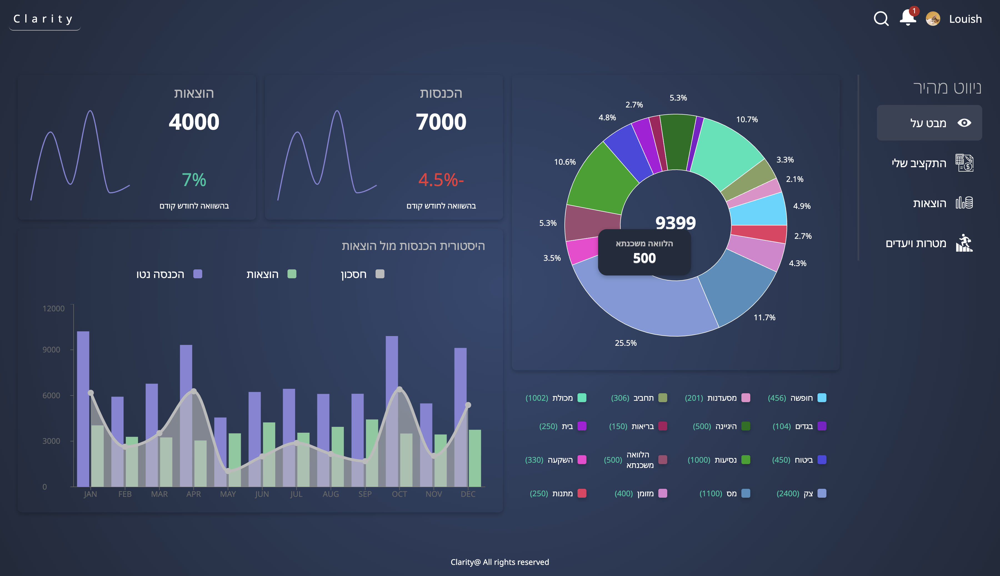

Certainly! Below is a template for a README file for your ongoing personal finance app project developed in TypeScript and React. Remember to replace placeholders with actual information and customize it further as needed.

---

# Personal Finance App

Welcome to the Personal Finance App project! This is a web application developed using TypeScript and React to help you manage your personal finances effectively.

## Table of Contents

- [Introduction](#introduction)
- [Features](#features)
- [Getting Started](#getting-started)
- [Usage](#usage)
- [Technologies Used](#technologies-used)
- [Contributing](#contributing)
- [License](#license)

## Introduction

The Personal Finance App is designed to assist users in tracking their income, expenses, and overall financial health. With an intuitive user interface and powerful features, it aims to provide a comprehensive solution for managing personal finances.

## Features

- **Expense Tracking:** Keep track of your daily expenses and categorize them for better insights.
- **Income Management:** Log your sources of income and monitor your earnings over time.
- **Budget Planning:** Set budgets for different categories and get alerts when you're close to exceeding them.
- **Visual Reports:** Visualize your financial data through charts and graphs for a clearer understanding.
- **Goal Setting:** Define financial goals and track your progress toward achieving them.
- **Secure Authentication:** Protect your financial data with secure user authentication.

## Getting Started

To run the app locally, follow these steps:

1. Clone this repository: `git clone https://github.com/MaxwellKnight/personal-finance-app.git`
2. Navigate to the project directory: `cd personal-finance-app`
3. Install dependencies: `npm install`
4. Start the development server: `npm run dev`

The app should now be running at `http://localhost:5173`.

## Usage

Here are a few screenshots showcasing the app's functionality:

_(Add more details about how to use your app effectively, along with screenshots of different pages and features.)_

## Technologies Used

- TypeScript
- React
- CSS (or your preferred styling method)
- ... (List any other major technologies or libraries used in your project)

## Contributing

Contributions are welcome! If you find any issues or have suggestions for improvements, feel free to open an issue or submit a pull request. Please read our [Contribution Guidelines](CONTRIBUTING.md) for more information.

## License

This project is licensed under the [MIT License](LICENSE).

---

_(End of README template)_

Remember to replace the placeholders with actual information specific to your project. Additionally, create the necessary files like `CONTRIBUTING.md`, `LICENSE`, and any other files you might want to include for your project's organization.
